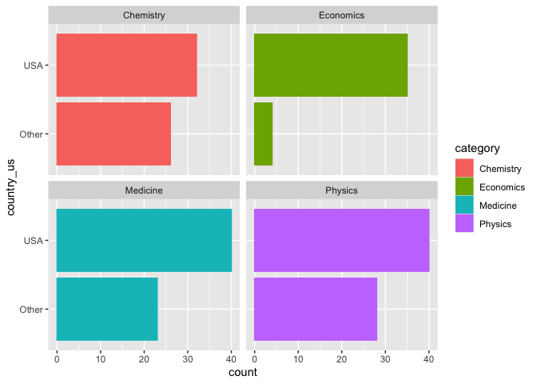
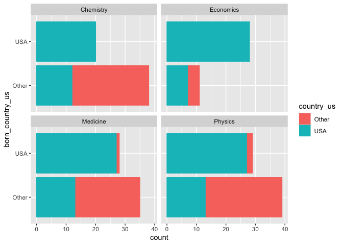

Lab 03 - Nobel laureates
================
Cynthia Jiao
1/27/2025

### Load packages and data

``` r
library(tidyverse) 
```

``` r
nobel <- read_csv("data/nobel.csv")
```

## Exercises

### Exercise 1

There are 935 observations and 26 variables in the dataset. Each row
represents a Nobel prize winner.

``` r
print(nobel)
```

    ## # A tibble: 935 × 26
    ##       id firstname   surname  year category affiliation city  country born_date 
    ##    <dbl> <chr>       <chr>   <dbl> <chr>    <chr>       <chr> <chr>   <date>    
    ##  1     1 Wilhelm Co… Röntgen  1901 Physics  Munich Uni… Muni… Germany 1845-03-27
    ##  2     2 Hendrik A.  Lorentz  1902 Physics  Leiden Uni… Leid… Nether… 1853-07-18
    ##  3     3 Pieter      Zeeman   1902 Physics  Amsterdam … Amst… Nether… 1865-05-25
    ##  4     4 Henri       Becque…  1903 Physics  École Poly… Paris France  1852-12-15
    ##  5     5 Pierre      Curie    1903 Physics  École muni… Paris France  1859-05-15
    ##  6     6 Marie       Curie    1903 Physics  <NA>        <NA>  <NA>    1867-11-07
    ##  7     6 Marie       Curie    1911 Chemist… Sorbonne U… Paris France  1867-11-07
    ##  8     8 Lord        Raylei…  1904 Physics  Royal Inst… Lond… United… 1842-11-12
    ##  9     9 Philipp     Lenard   1905 Physics  Kiel Unive… Kiel  Germany 1862-06-07
    ## 10    10 J.J.        Thomson  1906 Physics  University… Camb… United… 1856-12-18
    ## # ℹ 925 more rows
    ## # ℹ 17 more variables: died_date <date>, gender <chr>, born_city <chr>,
    ## #   born_country <chr>, born_country_code <chr>, died_city <chr>,
    ## #   died_country <chr>, died_country_code <chr>, overall_motivation <chr>,
    ## #   share <dbl>, motivation <chr>, born_country_original <chr>,
    ## #   born_city_original <chr>, died_country_original <chr>,
    ## #   died_city_original <chr>, city_original <chr>, country_original <chr>

### Exercise 2

``` r
library(dplyr)

##create new dataset

nobel_living <- nobel %>%
  filter(!is.na(country)) %>%
  filter(gender != "org") %>%
  filter(is.na(died_date))

##create new variable

nobel_living <- nobel_living %>%
  mutate(
    country_us = if_else(country == "USA", "USA", "Other")
  )

nobel_living_science <- nobel_living %>%
  filter(category %in% c("Physics", "Medicine", "Chemistry", "Economics"))
```

### Exercise 3

From the graph, it seems that more winners are in USA than other
countries when they win the prize. However, this graph does not
necessarily support Buzzfeed article claims, because it does NOT tell us
whether most of US nobel prize winners are immigrants (i.e., birthplace
not in the US).

``` r
ggplot(
  data = nobel_living_science,
  mapping = aes(
    y = country_us,
    color = category,
    fill = category
  )
) + geom_bar() +  
  facet_wrap(~ category)
```

<!-- -->

### Exercise 4

There are 123 winners who were not born in the US, and 105 who were born
in the US.

``` r
##create new variable

nobel_living_science <- nobel_living_science %>%
  mutate(
    born_country_us = if_else(born_country_original == "USA", "USA", "Other")
  )

##counting the number of US and non US born winners

table(nobel_living_science$born_country_us)
```

    ## 
    ## Other   USA 
    ##   123   105

### Exercise 5

The graph seems to show a consistent pattern with the Buzzfeed graph and
support their claim. On the graph, blue bars represents winners who are
in the US when winning, and the y axis shows whether these winners are
US born or not. Among US winners, although there are more US born
winners for each category, the numbers of non-US born winners are still
considerable (e.g., for medicine and physics, non-US born winners are
half the numbers of US born winners. For chemistry, non-US born winners
is more than 50% of US born winners).

``` r
ggplot(
  data = nobel_living_science,
  mapping = aes(
    y = born_country_us,
    color = country_us,
    fill = country_us
  )
) + geom_bar() +  
  facet_wrap(~ category)
```

<!-- -->

### Exercise 6

Germany and the UK are the most common countries to have other country
born, US prize winners. They each have 7.

``` r
##create the new variable

nobel_living_science %>%
  filter(country_us == "USA", born_country_us == "Other") %>% 
  count(born_country) %>%
  arrange(desc(n))
```

    ## # A tibble: 21 × 2
    ##    born_country       n
    ##    <chr>          <int>
    ##  1 Germany            7
    ##  2 United Kingdom     7
    ##  3 China              5
    ##  4 Canada             4
    ##  5 Japan              3
    ##  6 Australia          2
    ##  7 Israel             2
    ##  8 Norway             2
    ##  9 Austria            1
    ## 10 Finland            1
    ## # ℹ 11 more rows
